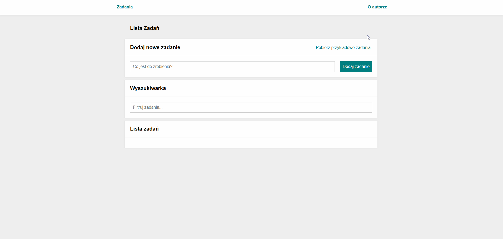

# 📝 To-do List

Simple task manager built with React and Redux Toolkit.

©2025 Bugs. All rights reserved.

## 🚀 Demo

👉 https://baks44.github.io/todos-list-react/

## ✨ Features

- Add new tasks
- Mark tasks as done
- Remove tasks
- Hide/show completed tasks
- Mark all tasks as done
- Global state management with Redux Toolkit

## 🛠 Technologies

- React
- Redux Toolkit
- React Redux
- JavaScript ES6+
- HTML5
- CSS3
- BEM
- Styled Components
- Normalize.css

## 🖼 Preview



## 📖 How it works

- Type your task in the input field and add it using the button
- Mark a task as done using the green button
- Hide completed tasks with **"Ukryj ukończone"**
- Mark all tasks done with **"Ukończ wszystkie"**
- Remove a task using the bin icon

## ▶️ Run locally

```bash
git clone https://github.com/Baks44/todos-list-react.git
cd todos-list-react
npm install
npm start
```
